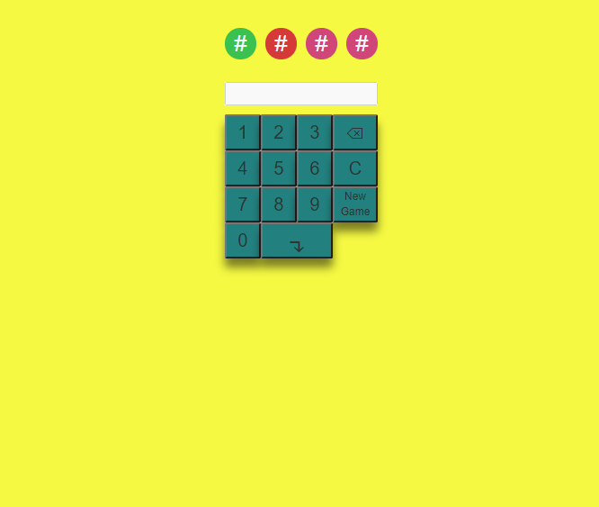

# 4 Digits Game

### Overview

4digits is a guess-the-number puzzle game. It's also called Bulls and Cows. I used to play this with classmate while in high school. 

### How to Play

Input 4 non-repeated number such as 1234. The game will return answer how many number(s) you guessed correctly. A stands for number(s) you guess is(are) correct and B stands for the postion of number(s) is (are) correct.

### Technologies

* Randpm generate non-repeated number from 0 to 9
* Random generate css color
* for loop to generate css shape
* Responsive design

### Project Link

https://wenhaowu27.github.io/4digit_game/

